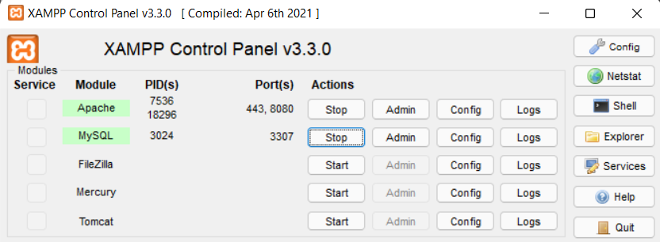
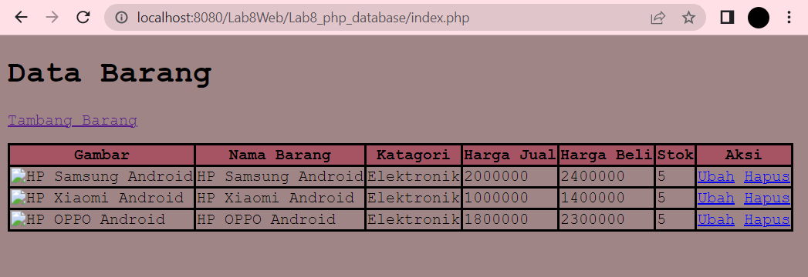

# PEMOGRAMAAN WEB

Diyan Arum Maheswari (312010133)

Teknik Informatika - UNIVERSITAS PELITA BANGSA
______________________________________________

## MEMBUAT APLIKASI CRUD SEDERHANA

Untuk dapat membuat aplikasi CRUD ini, ada beberapa hal yang harus disiapkan. Pertama, karena disini menggunaka MySQL sebagai database servernya pastikanlah MySQL kalian sudah dapat dijalankan melalui Xampp seperti gambar dibawah.



Jika MySQL dan Webserver Apachenya sudah running, selanjutnya bukalah web browser PHPMyAdmin dengan URL: http://localhost:8080/phpmyadmin/

## PEMBUATAN DATABASE

Kalian bisa langsung saja membuat database pada PHPMyAdmin dengan mengklik tombol MySQL yang ada diatas kemudian masukan kode dibawah kemudian klik kirim.

```mysql
CREATE DATABASE Latihan1;
```


## PEMBUATAN TABEL 


Setelah database berhasil dibuat. Selanjutnya proses pembuatan tabel pada database tersebut. Pembuatannya sama dengan sebelumnya, kalian hanya perlu menekan tombol MySQL pada Database sebelumnya kemudian masukan kode berikut:

```mysql
CREATE TABLE data_barang (
        id_barang int(10) auto_increment Primary Key,
        kategori varchar(30),
        nama varchar(30),
        gambar varchar(100),
        harga_beli decimal(10,0),
        harga_jual decimal(10,0),
        stok int(4)
);
```

## PENAMBAHAN DATA


Untuk dapat menambahkan data pada tabel yang sudah dibuat sebelumnya, kalian hanya perlu memasukan kode berikut pada bagian MySQLnya:

```mysql
INSERT INTO data_barang (kategori, nama, gambar, harga_beli, harga_jual, stok)
VALUES ('Elektronik', 'HP Samsung Android', 'hp_samsung.jpg', 2000000, 2400000, 5),
('Elektronik', 'HP Xiaomi Android', 'hp_xiaomi.jpg', 1000000, 1400000, 5),
('Elektronik', 'HP OPPO Android', 'hp_oppo.jpg', 1800000, 2300000, 5);
```

## PEMBUATAN PROGRAM CRUD

Pertama, buatlah sebuah folder baru dengan nama Lab8_php_database pada root directory web server (C:\xampp\htdocs\Lab8Web)


Kemudian untuk dapat mengaksesnya pada web server, gunakanlah URL : http://localhost:8080/Lab8Web/Lab8_php_database/


## MEMBUAT FILE KONEKSI DATABASE

Buatlah file baru dalam Directory Lab_php_dasar dengan nama file koneksi.php kemuadian masukan kode berikut:

```php
<?php
$host = "localhost:3307";
$user = "root";
$pass = "";
$db = "latihan1";

$conn = mysqli_connect($host, $user, $pass, $db);
if ($conn == false)
{
    echo "Koneksi ke server gagal.";
    die();
} else echo "Koneksi berhasil";
?>
```

 dan untuk mengaksesnya dapat menggunakan URL : http://localhost:8080/Lab8Web/Lab8_php_database/koneksi.php jika koneksi berhasil maka anda akan mendapatkan hasil seperti gambar dibawah ini.


## MENAMPILKAN DATA DENGAN FILE INDEX (READ)



Untuk menampilkan data seperti gambar diatas kalian perlu menggunakan kode dibawah ini:

```php
<?php
include("koneksi.php");

// query untuk menampilkan data
$sql = 'SELECT * FROM data_barang';
$result = mysqli_query($conn, $sql);
?>
```
```html
<!DOCTYPE html>
<html lang="en">
<head>
    <meta charset="UTF-8">
    <link href="style.css" rel="stylesheet" type="text/css" />
    <title>Data Barang</title>
</head>
<body>
    <div class="container">
        <h1>DATA BARANG</h1>
        <div class="main">
            <a href="tambah.php">Tambah Barang</a>
            <table>
            <tr>
                <th>Gambar</th>
                <th>Nama Barang</th>
                <th>Katagori</th>
                <th>Harga Jual</th>
                <th>Harga Beli</th>
                <th>Stok</th>
                <th>Aksi</th>
            </tr>
            <?php if($result): ?>
            <?php while($row = mysqli_fetch_array($result)): ?>
            <tr>
                <td>" alt="<?=
$row['nama'];?>"></td>
                <td><?= $row['nama'];?></td>
                <td><?= $row['kategori'];?></td>
                <td><?= $row['harga_beli'];?></td>
                <td><?= $row['harga_jual'];?></td>
                <td><?= $row['stok'];?></td>
                <td>
                <a href="ubah.php?id=<?= $row['id_barang'];?>">Ubah</a>
                <a href="hapus.php?id=<?= $row['id_barang'];?>">Hapus</a> 
                </td>
            </tr>
            <?php endwhile; else: ?>
            <tr>
                <td colspan="7">Belum ada data</td>
            </tr>
            <?php endif; ?>
            </table>
        </div>
    </div>
</body>
</html>
```

Dan agar tampilan lebih menarik dan berwarna kalian dapat menambahkan kode css berikut:

```css
body{
    background-color: rgb(159, 133, 133);
    font-family: 'Courier New', Courier, monospace;
}
table{
    border-collapse: collapse;
    margin-top: 15px;
}
th{
    background-color: rgb(166, 84, 100);
}
th,td{
    border: 2px solid rgb(0, 0, 0);
}
```

## MENAMBAHKAN DATA (CREATE)


Untuk menambahkan data seperti gambar diatas kalian perlu menggunakan kode dibawah ini:

```php
<?php
error_reporting(E_ALL);
include_once 'koneksi.php';

if (isset($_POST['submit']))
{
    $nama = $_POST['nama'];
    $kategori = $_POST['kategori'];
    $harga_jual = $_POST['harga_jual'];
    $harga_beli = $_POST['harga_beli'];
    $stok = $_POST['stok'];
    $file_gambar = $_FILES['file_gambar'];
    $gambar = null;
    if ($file_gambar['error'] == 0)
    {
        $filename = str_replace(' ', '_',$file_gambar['name']);
        $destination = dirname(__FILE__) .'/gambar/' . $filename;
        if(move_uploaded_file($file_gambar['tmp_name'], $destination))
        {
            $gambar = 'gambar/' . $filename;;
        }
    }
    $sql = 'INSERT INTO data_barang (nama, kategori,harga_jual, harga_beli,
stok, gambar) ';
    $sql .= "VALUE ('{$nama}', '{$kategori}','{$harga_jual}',
'{$harga_beli}', '{$stok}', '{$gambar}')";
    $result = mysqli_query($conn, $sql);
    header('location: index.php');
}
?>
```

```php
<!DOCTYPE html>
<html lang="en">
<head>
    <meta charset="UTF-8">
    <link href="style.css" rel="stylesheet" type="text/css" />
    <title>Tambah Barang</title>
</head>
<body>
<div class="container">
    <h1>TAMBAH BARANG</h1>
    <div class="main">
        <form method="post" action="tambah.php"
enctype="multipart/form-data">
        <div class="input">
            <label>Nama Barang</label>
            <input type="text" name="nama" />
        </div>
        <div class="input">
            <label>Kategori</label>
            <select name="kategori">
                <option value="Komputer">Komputer</option>
                <option value="Elektronik">Elektronik</option>
                <option value="Hand Phone">Hand Phone</option>
<           </select>
        </div>
        <div class="input">
            <label>Harga Jual</label>
            <input type="text" name="harga_jual" />
        </div>
        <div class="input">
            <label>Harga Beli</label>
            <input type="text" name="harga_beli" />
        </div>
        <div class="input">
            <label>Stock</label>
            <input type="text" name="stok" />
        </div>
        <div class="input">
            <label>File Gambar</label>
            <input type="file" name="file_gambar" />
        </div>
        <div class="submit">
            <input type="submit" name="submit" value="Simpan" />
        </div>
      </form>
    </div>
</div>
</body>
</html>
```

Dengan menambahkan css berikut:

```css
.input{
    padding: 5px;
}
.input label{
    display: inline-block;
    width: 100px;
}
```

## MENGUBAH DATA (UPDATE)


# <P align="center"> THANK'S FOR YOUR ATTENTION!! SEE YOU!!
